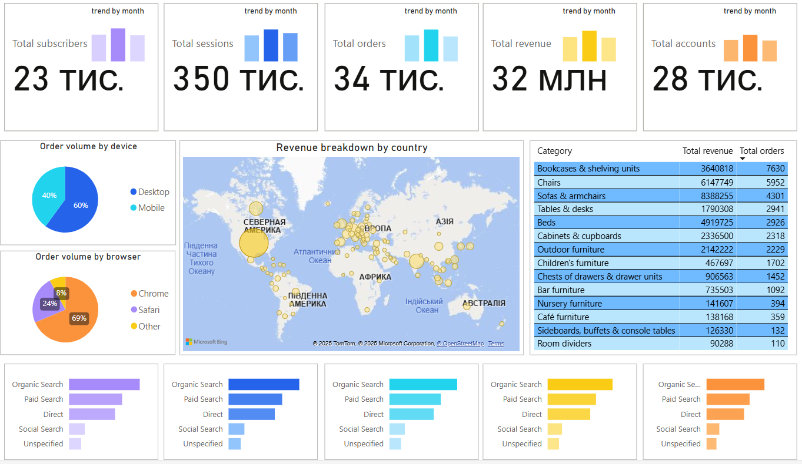

# E-commerce Data Analysis



An in-depth analysis of e-commerce transactions to uncover sales trends, product performance, regional insights, and optimization opportunities for business growth.

---

## Project Overview

This repository contains the code and resources for an in-depth E-commerce sales analysis project. 
The analysis was conducted in Google Colab, using direct integration with Google BigQuery for data extraction via SQL. 
The results were visualized using Power BI.

---

## Table of Contents

* [Setup](#setup)
* [Data Structure](#data-structure)
* [Key Features](#key-features)
* [Main Findings](#main-findings)
* [Visualizations](#visualizations)
* [Future Work](#future-work)

---

##  Setup

### Prerequisites

* Python 3.x
* BigQuery
* Power BI

### Required Python Packages

* `pandas`
* `numpy`
* `matplotlib`
* `seaborn`
* `scipy.stats`

### Installation

Clone the repository:

```bash
git clone https://github.com/your-username/ecommerce-analysis.git
cd ecommerce-analysis
```

Install required packages:

```bash
pip install -r requirements.txt
```

Run the notebook:

```bash
jupyter notebook E_commerce_Analysis.ipynb
```

---

## 🗂 Data Structure

The dataset was extracted from BigQuery and includes the following fields:

| Column              | Description                                              |
| ------------------- | -------------------------------------------------------- |
| `order_date`        | Date of the session or transaction                       |
| `ga_session_id`     | Unique session identifier                                |
| `continent`         | Continent where the session occurred                     |
| `country`           | Country where the session occurred                       |
| `device`            | Type of device used (e.g., desktop, mobile)              |
| `browser`           | Browser used during the session                          |
| `mobile_model_name` | Mobile model name                                        |
| `operating_system`  | Operating system of the user's device                    |
| `language`          | User's language settings                                 |
| `channel_info`      | Marketing or sales channel grouping                      |
| `traffic_channel`   | Specific traffic source (e.g., organic, paid, referral)  |
| `email_verified`    | Whether the user's email is verified                     |
| `unsubscribed`      | Whether the user unsubscribed from marketing             |
| `account_id`        | Customer's account ID (if registered)                    |
| `product_category`  | Category of the purchased product                        |
| `product_name`      | Name of the purchased product                            |
| `product_price`     | Price of the product at the time of purchase             |
| `short_description` | Product description or snippet                           |


---

## Key Features

* **Data Cleaning**: Handling missing values, standardizing formats
* **Category & Product Analysis**: Revenue and quantity-based rankings
* **Country-Level Breakdown**: Contribution of different regions to overall sales
* **Temporal Patterns**: Monthly and seasonal dynamics
* **ABC Analysis**: Categorization of products based on cumulative revenue contribution
* **Visualization**: Graphical representation for better understanding

---

## Main Findings

### Product Performance

* High-revenue items are often not the most frequently sold
* Categories like **Office Supplies** and **Technology** dominate revenue
* Pareto principle holds: top \~20% products contribute \~80% of revenue

### Regional Insights

* Key contributing countries identified using ISO codes and region mapping
* Disparities in product demand across regions

### Temporal Trends

* Sales fluctuate across months, with spikes tied to specific seasons or campaigns
* Year-over-year growth (if time range allows)

### ABC Analysis

* Products segmented into A (high value), B (moderate), and C (low value)
* Helps prioritize inventory and marketing strategies

---

## Visualizations

Includes:

* Bar charts of top products and categories
* Line plots for revenue trends over time
* Heatmaps for regional distribution
* Pie charts for contribution breakdowns
* ABC scatter plots with category overlays

---

## Future Work

* Build a sales forecasting model using time series methods
* Apply customer segmentation using RFM analysis
* Create an interactive dashboard (e.g., with Streamlit or Tableau)
* Integrate promotional impact analysis
* Extend ABC analysis with product lifecycle tracking
